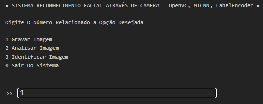
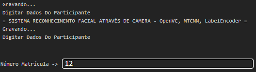
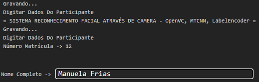
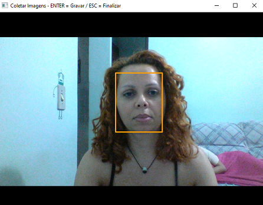
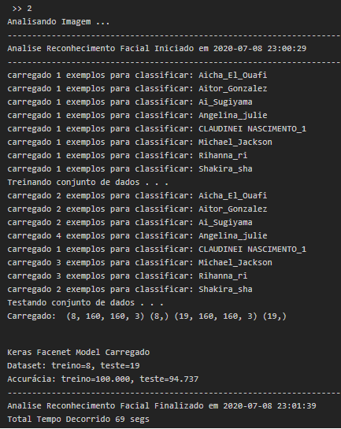
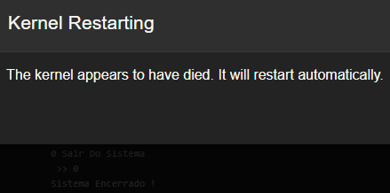

<html>
<meta name="viewport" content="width=device-width, initial-scale=1">
<link rel="stylesheet" href="github-markdown.css">
 
<article class="markdown-body">
    <h1>Unicorns</h1>
    
All the things

</article>
</html>
<h2 align="center"><strong>Sistema Reconhecimento facial em tempo real através da webcam</strong></h2>
<h4 align="left">Nivel Conhecimento : Estudante Iniciante &#x1F393;</h4>

  
<strong>1. CONCEITOS DE FORMA SIMPLES</strong>

  <ol>
    <li><strong>Reconhecimento Facial</strong>
      
É a técnica de capturar/pegar em uma imagem toda a parte frontal do rosto/face que envolve parte da cabeça, testa, olhos, nariz, maças do rosto, bochechas, boca, maxilar, queixo, analisar a distância entre cada uma destas partes, comparar com outras imagens, identificar diferenças, comparar similaridades e exibir o alvo desejado.

      
A imagem considerada pode ser uma foto, vídeo ou câmera.

      
O alvo desejado é o ser humano que será identificado.

    </li>
    <li><strong>Machine Learning</strong>
      
É a técnica computacional de ensinar uma máquina com determinado poder computacional a analisar um conjunto de dados e predizer informações para auxiliar nas decisões.

      
Esta técnica pode ser utilizada para tentar resolver qualquer tarefa, da mais simples a mai complexa.

    </li>
    <li><strong>Deep Learning</strong>
      
É a técnica computacional que analisa muito detalhadamente determinadas características de imagem para auxiliar a identificar quem esta na imagem.

    </li>
    <li><strong>Neural Network</strong>
      
É um algoritmo computacional que aprende com novos dados inseridos, simulando o cérebro humano.

      
Exemplo: Programar um computador para aprender todos os detalhes de forma e formato de um determinado rosto, ao inserimos outros rostos ele automaticamente armazenara as suas formas e formatos e a partir dai conseguiremos extrair a quem pertence determinado rosto

    </li>
  </ol>

  
<strong>2. INFORMAÇÕES TÉCNICAS</strong>

  <ol>
    <li><strong><a id="itemtec" >Tecnologias utilizadas neste projeto</a></strong>
      <ol>
        

        <li>- [x] Linguagem de programação : python 3.7.7</li>
        <li>- [x] Python Package Index -pip : versão 20.1.1</li>
        <li>- [x] Visual Studio Code : Version: 1.46.0 (user setup) Electron: 7.3.1</li>
        <li>- [x] OS : Windows_NT x64 10.0.18363 (Windows 10 Home)</li>
        <li>- [x] CPU : Intel(R) Corel(TM) i3-4005U CPU @ 1.70GHz 1.70 GHz</li>
        <li>- [x] RAM : 8GB</li>
        <li>- [x] SSD : 225GB</li>
        <li>- [x] Browser : Chrome: 78.0.3904.130</li>
        <li>- [x] Plataforma Front de Desenvolvimento : Jupyter notebook 4.6.3</li>
        <li>- [x] Plataforma Back de Desenvolvimento : miniconda-conda 4.8.3</li>
        

      </ol>
    </li>
    <li><strong>Algoritmos de visão computacional  para</strong>
      <ol>
        

        <li>- [x] Acessar a webcam local do computador, notebook </li>
        <li>- [x] Exibir a imagem em tempo real através da webcam</li>
        

      </ol>
    </li>
    <li><strong>Algoritmos deep learning e neural networks <a style="font-color:green"  href="https://pypi.org/project/mtcnn/" target="_blank">mtcnn 0.1.0</a> para</strong>
      <ol>
        

        <li>- [x] Aplicar na imagem capturada diversos cálculos de reconhecimento de forma e formato</li>
        <li>- [x] Disponibilizar resultado dos cálculos aos algoritmos machine learning</li>
        

      </ol>
    </li>
    <li><strong>Utilizando as técnicas machine learning vamos</strong>
      <ol>
        

          <li>- [x] Calcular o Embedding da imagem</li>
          <li>- [x] Aplicar Standartization</li>
          <li>- [x] Aplicar Normatization com Normalizer da sklearn</li>
          <li>- [x] Converter os dados categóricos em numéricos com o LabelEncoder</li>
          <li>- [x] Executar treinamento de reconhecimento facial do algorítimo SVC da sklearn.svm</li>
          <li>- [x] Utilizar o algoritmo de predição svm nos dados de treino e teste</li>
          <li>- [x] Aplicar o cáculo de acurácia/precisão do algorítimo accuracy_score da sklearn.metrics</li>
          <li>- [x] Calcular as coordenadas da face</li>
          <li>- [x] Utilizar o método de predição do modelo facenet_keras.h5 na imagem visualizada pela webcam</li>
          <li>- [x] Aplicar o método Normalizer l2</li>
          <li>- [x] Utilizar a inversão do LabelEncoder</li>
          <li>- [x] Exibir o resultado da identificação no algorítimo OpenCV pela webcam</li>
        

      </ol>
    </li>    
  </ol>

  
<strong><a id="prereq">3. PRE-REQUISITOS PARA FUNCIONAMENTO DO SISTEMA</a></strong>

  <ol>
    <li><strong>Instalar as plataformas de desenvolvimento</strong>
      <ol>
        

          <li>- [x] Instalar <a href="https://docs.conda.io/en/latest/miniconda.html" target="_blank">miniconda3</a></li>
          <li>- [x] Instalar <a href="https://jupyterlab.readthedocs.io/en/stable/getting_started/installation.html" target="_blank">jupyter notebook</a></li>
          <li>- [x] Instalar <a href="https://code.visualstudio.com/download" target="_blank">visual studio code</a></li>
        

      </ol>
      
<b>Nota: </b> Analisar o item <em><a href="#itemtec">Tecnologias utilizadas neste projeto</a></em>

    </li>
    <li><strong>Instalar as bibliotecas de algoritmos</strong>
      <ol>
        <li>- [x] Atualizar o instalador pip - python package index :computer: python3 -m pip install --upgrade pip</li>
        <li>- [x] Recomendo utilizar o prompt/terminal do anaconda e/ou miniconda para instalar as bibliotecas, por ser mais prático e apresentar menos inconsistências.</li>
        <li>- [x] Sintaxe para instalar bibliotecas : pip3 install [nome_biblioteca] --user</li>
        <li>- [x] Desbloquear sua webcam em seu anti-virus e/ou firewall</li>
      </ol>
    </li> 
    <table>
      <thead>
        <tr>
          <th>Biblioteca</th>
          <th scope="col">Objetivo</th>
        </tr>
      </thead>
      <tbody>
        <tr>
          <th scope="row">pandas</th>
          <td>Estrutura de dados e ferramentas de análise de dados</td>
        </tr>
        <tr>
          <th scope="row">numpy</th>
          <td>Algoritmos para cálculos matemáticos e computação científica</td>
        </tr>
        <tr>
          <th>opencv-contrib-python</th>
          <td>Algoritmos de visão computacional</td>
        </tr>
        <tr>
          <th>scikit-learn</th>
          <td>Algoritmos para classificação, regressão, agrupamento, dimensionalidade, validações, melhorias na precisão de predições, reprocessamentos, normalizações</td>
        </tr>
        <tr>
          <th>scipy</th>
          <td>Cálculos científicos com numpy</td>
        </tr>
        <tr>
          <th>keras</th>
          <td>É uma interface de aplicação de programação desenvolvida para seres humanos, não para máquinas</td>
        </tr>
        <tr>
          <th>Pillow</th>
          <td>Biblioteca com algoritmos para ler, escrever, criar, inserir, converter, cortar, redimensionar imagens</td>
        </tr>
        <tr>
          <th>mtcnn</th>
          <td>Algoritmos para reconhecimento facial -Face Recognition</td>
        </tr>
        <tr>
          <th>tensorflow</th>
          <td>Serviço flexível e de alto desempenho para machine learning, feito para ambientes de produção</td>
        </tr>
      </tbody>
    </table>
  </ol>

  
<strong>4. INSTALAÇÃO DO SISTEMA</strong>

  <ol>
    <li>Cumprir o item <a href="#prereq">3. PRE-REQUISITOS PARA FUNCIONAMENTO DO SISTEMA</a></li>
    <li>Baixar o notebook facenet-mtcnn-labelencoder.ipynb</li>
  </ol>

  
<strong>5. PROCEDIMENTOS PARA UTILIZAR O SISTEMA</strong>

  <table>
    <thead>
      <tr>
        <ol>
          <li>Criar estrutura de diretório, para armazenar os arquivos disponibilizados neste repositório. A seguir um modelo de estrutura como orientação :
            <figure role="img" aria-labelledby="direc_struc">
              <pre>
              c:/temp/facenet/ : colocar aqui o conteudo do arquivo dataset.rar, que esta na em files
              c:/temp/facenet/ : colocar aqui o conteudo do arquivo facenet_keras.rar, que esta em files
              c:/temp/facenet/facerecognition : os arquivos serão criados no rotina de treinamento do modelo
              </pre>
            </figure>
          </li>
          <li>Fazer o download do arquivo facenet_keras.rar e descompactar no diretorio facenet</li>
          <li>Abrir o notebook facenet-keras-mtcnn-labelencoder.ipynb no jupyter notebook e :
            <ol>
              <li>Na class RegisterImg: substituir conteúdo da variável self.grv_img pelo local em que o conteúdo do dataset.rar foi gravado</li>
              <li>Na class FaceTrainer: substituir conteúdo da variável self.datasetpath pelo local em que o conteúdo do dataset.rar foi gravado</li>
              <li>Na class FaceTrainer: substituir conteúdo da variável self.faces_npz pelo local em que o conteúdo do dataset.rar foi gravado</li>
              <li>Na class FaceTrainer: substituir conteúdo da variável self.keras_facenet pelo local em que o conteúdo do facenet_keras.rar foi gravado</li>
              <li>Na class FaceTrainer: substituir conteúdo da variável self.faces_embeddings pelo local em que você criou o diretório facerecognition</li>
              <li>Na class FaceTrainer: substituir conteúdo da variável self.svm_classifier pelo local em que você criou o diretório facerecognition</li>
              <li>Na class FaceDetector: substituir conteúdo da variável self.facenet_model pelo local em que o conteúdo do facenet_keras.rar foi gravado</li>
              <li>Na class FaceDetector: substituir conteúdo da variável self.svm_model pelo local em que você criou o diretório facerecognition</li>
              <li>Na class FaceDetector: substituir conteúdo da variável self.data pelo local em que você criou o diretório facerecognition</li>
            </ol> 
          </li>
          <li>Executar as 5 linhas de códigos</li>
          <li>A linha com os códigos a seguir apresentará uma nova linha solicitando algumas informações
            <pre>
              if __name__ == "__main__":
                os.system('cls')
                menu = MainMenu()
                menu.menu_inicial()
            </pre>
          </li>
          <li>Para gravar sua imagem no conjunto de dados, digitar 1 no campo seguido de >> : 
            
            <ol>
              <li>No campo 'Número Matrícula -> ', digitar o número da matricula 
                
              </li>
              <li>No campo 'Nome Completo -> ', digitar o primeiro nome de quem esta sendo filmado 
                
              </li>
              <li>O sistema se conectará em sua webcam, para lhe filmar. A luz de sua webcam ligará e uma janela com sua imagem será habilitada em em barra de taferas 
                
              </li>
            </ol>
            
<b>Note : </b> Na parte superior desta janela há informação para pressionar ENTER para gravar ou ESC para Finalizar

            
<b>Importante : </b> Pressione ESC para sair, caso queira executar uma das outras tarefas

          </li>
          <li>Para treinar o algoritmo com a nova imagem, digitar 2. O sistema exibirá uma imagem similar a seguinte : 
            
            
<b>Note : </b>O sistema 
              1. criara os arquivos faces_dataset_embeddings.npz e SVM_classifier.sav no diretório facerecognition 
              2. criara o arquivo faces_dataset.npz no diretório dataset 
              3. finalizara e retorna ao menu principal
            

          </li>
          <li><b> - / - </b></li> 
          <li><b> - / - </b></li>
          <li>Para finalizar o sistema, digite 0 (zero). Uma janela similar a seguinte deverá aparece : 
            
          </li>
      </tr>
    </thead>
  </table>

  
<strong>6. FONTES DE ESTUDO</strong>
 
  <ul>
    <li><a href="https://minerandodados.com.br/">Minerando Dados</a></li>
    <li><a href="https://opencv.org/">Site OpenCV</a></li>
    <li><a href="https://github.com/opencv/opencv/">OpenCV no github</a></li>
    <li><a href="https://www.partnershiponai.org/wp-content/uploads/2020/02/Understanding-Facial-Recognition-Paper_final.pdf">Partnershiponai.org</a></li>
    <li><a href="https://www.techradar.com/news/what-is-a-neural-network">Techradar</a></li>
    <li><a href="https://en.wikipedia.org/wiki/Artificial_neural_network">Wikpedia-Neural Network</a></li>
    <li><a href="https://scikit-learn.org/stable/">scikit-learn</a></li>
    <li><a href="https://scikit-learn.org/stable/_downloads/scikit-learn-docs.pdf">LabelEncoder</a></li>
    <li><a href="http://scipy.github.io/devdocs/hacking.html">scipy</a></li>
    <li><a href="https://keras.io/">keras</a></li>
    <li><a href="https://pillow.readthedocs.io/en/stable/">Pillow</a></li>
    <li><a href="https://pypi.org/project/mtcnn/">mtcnn</a></li>
    <li><a href="https://www.tensorflow.org/guide/tensor">tensorflow</a></li>
    <li><a href="https://pythonprogramming.net/linear-svc-example-scikit-learn-svm-python/r">SVC e SVM</a></li>
  </ul>

 
 
 
 
 
 
 

https://keras.io/
 
 
 
 
 
 
 
## Sistema Reconhecimento facial em tempo real através da webcam

### 1. CONCEITOS DE FORMA SIMPLES
### Reconhecimento Facial
É a técnica de capturar/pegar toda a parte do rosto que envolve testa, olhos, nariz, bochechas, boca, maxilar, queixo, analisar a distância entre cada uma destas partes, comparar com outras imagens, identificar diferenças, apontar similaridades e exibir resultado mais próximo ao que desejamos

A imagem considerada é uma foto, vídeo ou câmera

### Machine Learning
É a técnica computacional de ensinar uma máquina com determinado poder computacional a resolver tarefas complexas para predizer ações passadas ou futuras o mais automático possível
Esta técnica pode ser utilizada para tentar resolver qualquer tarefa, por mais complexa que seja

### Deep Learning
É a técnica computacional que analisa muito detalhadamente determinadas características de imagem, aúdio ou voz para auxiliar a identificar o seu autor e/ou

### 2. INFORMAÇÕES TÉCNICAS
### Tecnologias utilizadas neste projeto
- [X] Linguagem de programação : python 3.7.7
- [X] Visual Studio Code : Version: 1.46.0 (user setup) Commit: a5d1cc28bb5da32ec67e86cc50f84c67cc690321 Date: 2020-06-10T09:03:20.462Z Electron: 7.3.1
- [X] OS : Windows_NT Home x64 10.0.18363
- [X] CPU : Intel(R) Corel(TM) i3-4005U CPU @ 1.70GHz 1.70 GHz
- [X] RAM : 8GB
- [X] SSD : 225GB
- [X] Browser : Chrome: 78.0.3904.130
- [X] Plataforma Front de Desenvolvimento : Jupyter notebook 4.6.3
- [X] Plataforma Back de Desenvolvimento : miniconda-conda 4.8.3

### Utilizando algoritmos deep learning para desenvolver um sistema que
- [X] Acessará a webcam local do computador, notebook com o algoritmo  
- [X] Gravará a imagem com outras imagens no computador local

### Utilizando as técnicas machine learning vamos 
- [X] Aplicar Standartization
- [X] Aplicar Normatization
- [X] Executar treinamento de reconhecimento facial do algorítimo MTCNN
- [X] Utilizar técnica de Predição do algorítimo MTCNN
- [X] Converter dados categóricos em numéricos com LabelEncoder
- [X] Treinar o modelo Classificador SVC-SVM

### 3. PRE-REQUISITOS PARA FUNCIONAMENTO DO SISTEMA
### Plataformas para desenvolvimento
* Instalar miniconda3
* Instalar jupyter notebook
* Instalar Visual Studio Code

Observação: Analisar o item **Tecnologias utilizadas neste projeto**

### Bibliotecas python utilizadas
<ol>
  <li>opencv-custom</li>
  <li>pandas</li>
  <li>SVC</li>
  <li>MTCNN</li>
</ol>

### 4. FLUXO DO PROCESSO
Desenvolver com a linguagem python um algoritmo machine learning em modo supervisionado para utilizar a tecnologia deep learning no reconhecimento facial

### 5. INSTALAÇÃO DO SISTEMA RECONHECIMENTO FACIAL EM TEMPO REAL ATRAVÉS DA WEBCAM
- [X] Baixar o arquivo dszero-desafio-facenet-mtcnn-labelencoder.ipynb
- [X] 

#### Origem deste projeto
Este foi um desafio proposto no curso Data Science do Zero da equipe Minerando Dados

#### Fontes de estudo
* [Minerando Dados](https://minerandodados.com.br/ "Minerando Dados")
* [Site OpenCV](https://opencv.org/ "Site OpenCV")
* [OpenCV no github](https://github.com/opencv/opencv/ "OpenCV no github")
* [Partnershiponai.org](https://www.partnershiponai.org/wp-content/uploads/2020/02/Understanding-Facial-Recognition-Paper_final.pdf "Partnershiponai.org")
* [Techradar](https://www.techradar.com/news/what-is-a-neural-network)
* [Wikpedia-Neural Network](https://en.wikipedia.org/wiki/Artificial_neural_network)
* [scikit-learn](https://scikit-learn.org/stable/)
* [scipy](http://scipy.github.io/devdocs/hacking.html)
* 

### *AGRADECIMENTOS*
*Ser agradecido para mim é a atitude que torna as pessoas seres melhores*

Agradeço a mulher mais importante da minha vida, a minha mãe sra Rosalita Borges Evangelista por ter me sido uma lutadora incansável, lutando por mim, para mim e junto a mim e também aos meus irmãos. Minha mãe é o motivo deu me tornar ser humano honrado.

Agradeço aos meus dois irmãos que me ajudaram nos momentos em que mais precisei

Agradeço à minha esposa e às minhas filhas por serem minha razão, emoção e inspiração e pelo apoio em minhas decisões

Agradeço aos criadores do computador, da internet, das linguagens para programação computacional, inteligência artificial e tecnologias em geral

Agradeço a equipe Minerando Dados que criou o espaço Data Sciente do Zero, disponibilizando diversos ensinamentos em machine learning, estatísticas, deep learning e data science, parq encurtar meu aprendizado

Muito obrigado a todos :wink:
